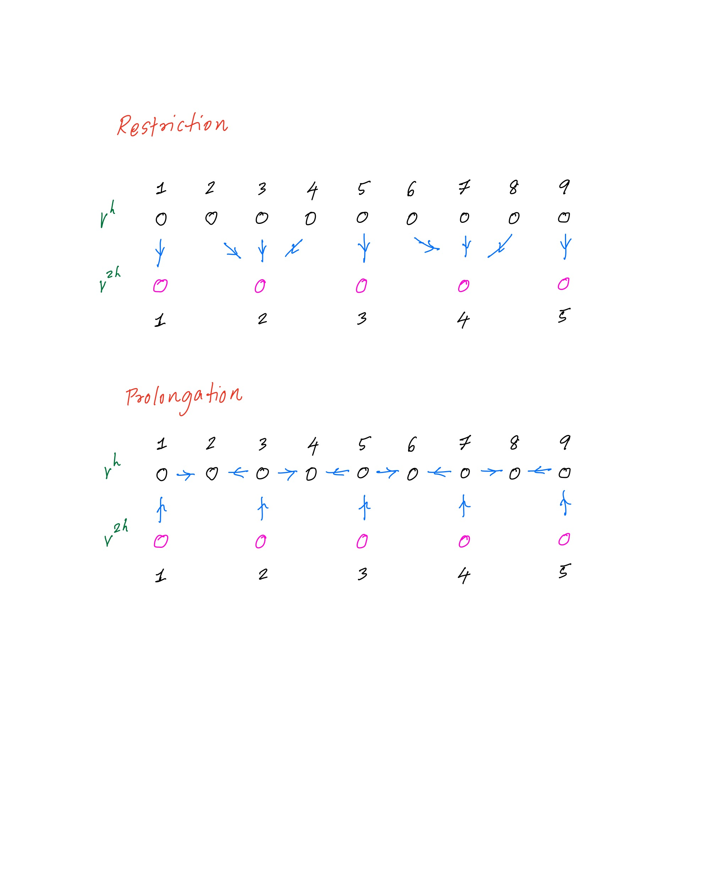

# 1d Poisson equation

Solves the problem

```text
    -u''(x) = f(x)
```

with Dirichlet bc. There are two methods available SOR and v-cycle multigrid.

```shell
./main --N 128 --method mg  --levels 7
./main --N 256 --method mg  --levels 8

./main --N 128 --method sor
./main --N 256 --method sor
```

Plot the numerical and exact solution in gnuplot

```gnuplot
gnuplot> p 'sol.txt' t 'Numerical' w p, x + sin(2*pi*x) t 'Exact' w l
```

For best multigrid convergence, use `N = 2^n` and `levels = n`. This leads to 3 points at coarsest level and only one unknown, in which case the coarse solve, even with Jacobi, is exact. 

## Restriction and prolangation

<p align="center">

</p>
