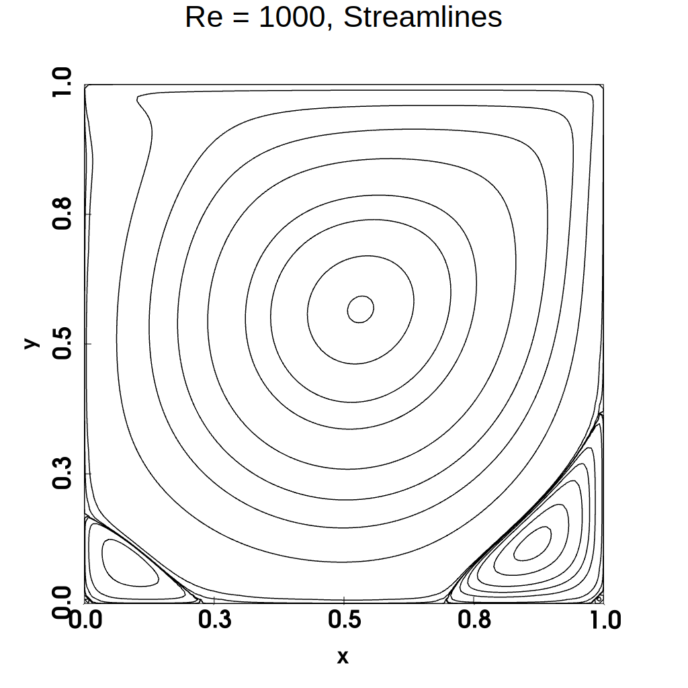
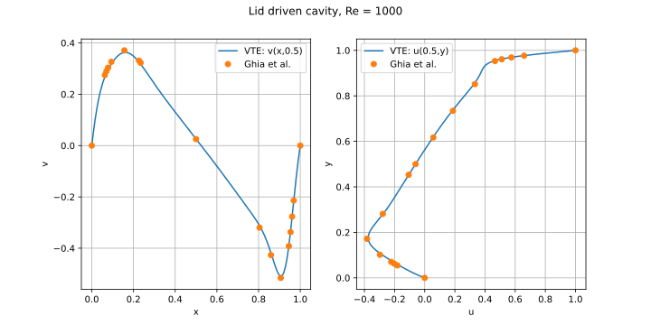

# 2d vorticity-streamfunction solver

The method is described in my notes `vte2d.tm`.

## Test Poisson solver

```shell
./test_poisson  -h    # shows available command line args
./test_poisson        # run with default options
visit -o poisson.vtk  # see the solution
```

## Test VTE solver

```shell
./vte -h                   # shows available command line args
./vte --n 128 --Re 1000
python stream.py           # plot streamlines, needs pyvista
python vel.py --Re 1000    # compare velocity with Ghia
```

[Ghia et al.](https://doi.org/10.1016/0021-9991(82)90058-4) results were taken from [here](https://github.com/CliMA/Oceananigans.jl/blob/main/validation/lid_driven_cavity/plot_lid_driven_cavity.py). The figures show the streamlines for Re=1000 and comparison of velocity profile along center line of the domain.

<p align="center">


</p>

## Looping over red-black

An alternate way to do the loops over red and black points in the Poisson solver is to use a conditional,

```chapel
forall (i,j) in inner do
if (i+j)%2 == 0 // red points
{
    // apply SOR
}

forall (i,j) in inner do
if (i+j)%2 == 1 // black points
{
    // apply SOR
}
```

But my timing tests seem to show this is bit slower.

## Running on multiple locales

I have not tested this but the code should work on multiple locales, except for the solution output functions in the VTK module which are serial.
